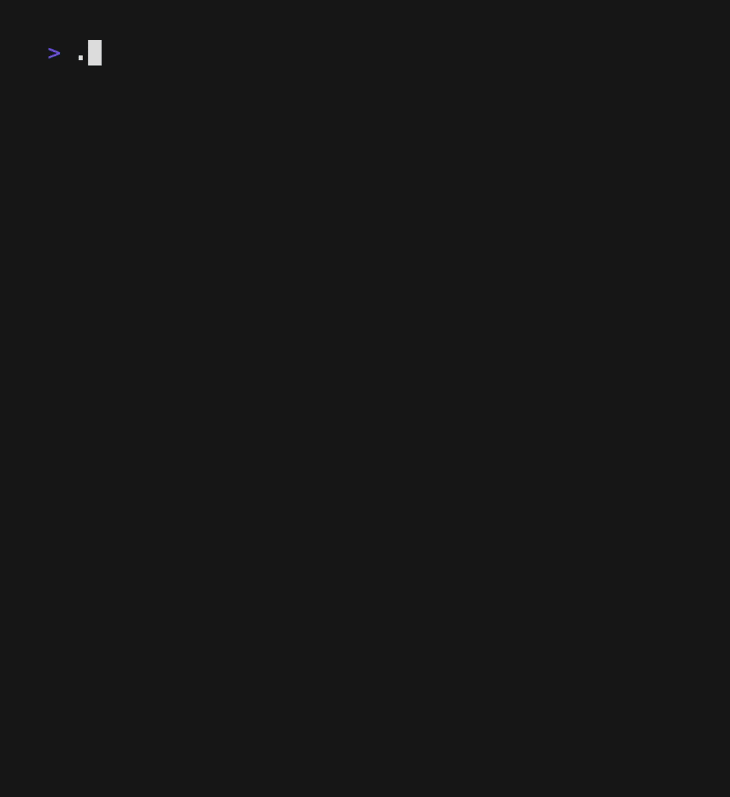

# Github commit race

Chart bar race from a Github repository contributors.



## How to use

Run the command `gh-commit-race` and follow the instructions.

### Extra options

Run `gh-commit-race --help` for the following options:

```
-j, --json-input <JSON_INPUT>  Location of the file with the JSON contributors data
-b, --blacklist <BLACKLIST>    List of contributors to blacklist
-u, --users <USERS>            Amount of users to display [default: 5]
```

Example:

`gh-commit-race --blacklist "user1" --blacklist "user2" --users 10`


### Private repositories

The easiest way is to download the contributors json from the insights page of your repository.

- Open the browser where you are logged in github and open network tab
- Go to https://github.com/user/repo/graphs/contributors
- Find a call to `contributors-data` and save the response in a file
- run the command `gh-commit-race --json-input "path/to/file.json"`

## TODO

- [ ] learn rust
- [ ] add better error handling
- [ ] improve ui

## Download

Get the latest from the [releases page](https://github.com/angel-git/gh-commit-race/releases)

## Release

This is very rudimentary, but it works. I will improve it in the "future".

- Update version on `Cargo.toml`, ie: `version = "1.0.0"`
- Create a new release on github with a new tag, ie: `v1.0.0`
- Let the github action trigger, build and upload new version to github releases